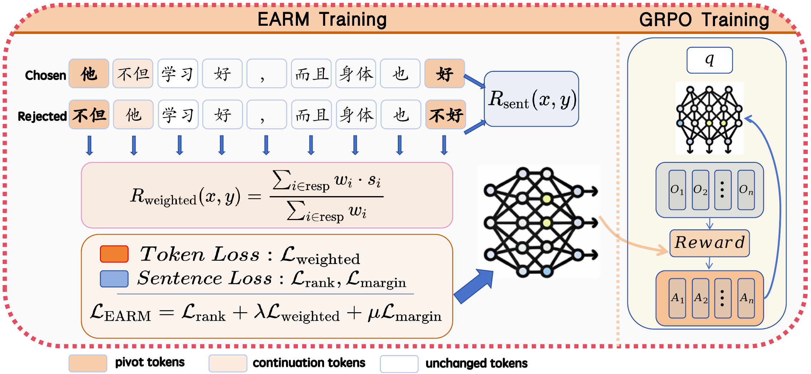

# EARM: Edit-Aware Reward Modeling for Chinese Grammatical Error Correction

Official implementation of our ACL 2026 long paper:

**Edit-Aware Reward Modeling for Chinese Grammatical Error Correction**  
Yilin Li and Xiaojun Wan  
Proceedings of ACL 2026

Paper: [ACL Anthology](https://aclanthology.org/2026.acl-long.1900/) | DOI: [10.18653/v1/2026.acl-long.1900](https://doi.org/10.18653/v1/2026.acl-long.1900)

## Overview

EARM is an edit-aware reward model for Chinese grammatical error correction (CGEC). It learns fine-grained preference signals by explicitly modeling edit operations, instead of relying on coarse rule-based rewards.

The model jointly optimizes sentence-level and token-level weighted Bradley-Terry ranking losses. Edit-related tokens receive larger weights, allowing the reward model to better distinguish subtle correction quality differences. EARM can be used as a reward function for GRPO and as a reranker for best-of-N candidate selection.

<p align="center">
  
</p>

Main results from the paper:

- EARM + GRPO achieves 61.29 / 63.08 F0.5 on FCGEC / NaCGEC in the single-output setting.
- With best-of-16 reranking, EARM reaches 65.04 / 64.59 F0.5 on FCGEC / NaCGEC.

## Repository Structure

```text
EARM/
├── build_earm_data.py          # Build EARM preference training data
├── earm_dataset.py             # Dataset and dataloader
├── earm_model.py               # Edit-aware reward model
├── train_earm.py               # Reward model training
├── api.py                      # FastAPI service for reward scoring
├── test_rm.py                  # Best-of-N generation and EARM reranking
├── requirements.txt
├── scripts/
│   ├── run_build_data.sh
│   └── run_train_earm_sft.sh
└── utils/
```

## Installation

```bash
pip install -r requirements.txt
python -m spacy download en_core_web_sm
```

## Build Training Data

Fill in the paths in `scripts/run_build_data.sh`, or run:

```bash
python build_earm_data.py \
  --merge_folder <MERGE_FOLDER> \
  --output_dir ./outputs/earm_train_data.json \
  --model_name <BASE_MODEL_PATH>
```

`<MERGE_FOLDER>` should contain one or more `.json` files. Each file is a list of samples with the following fields:

- `ori`: the original sentence with grammatical errors
- `ans`: reference correction(s), either a string, a tab-separated string, or a list of strings
- `tgt`: candidate corrections generated by a model

Example:

```text
data/candidates/
├── fcgec_part1.json
└── fcgec_part2.json
```

```json
[
  {
    "ori": "他不但学习好，而且身体也不好。",
    "ans": ["他不但学习好，而且身体也好。"],
    "tgt": [
      "他不但学习好，而且身体也好。",
      "他不但学习好，而且身体也不好。",
      "他不仅学习好，而且身体也很好。"
    ]
  }
]
```

The script merges all JSON files in `<MERGE_FOLDER>`, deduplicates candidates, and constructs preference pairs where the chosen candidate is closer to the reference correction than the rejected candidate.

## Train EARM

Fill in the paths in `scripts/run_train_earm_sft.sh`, or run:

```bash
accelerate launch --num_processes 1 train_earm.py \
  --train_data ./outputs/earm_train_data.json \
  --val_data ./outputs/earm_val_data.json \
  --model_name <BASE_MODEL_PATH> \
  --output_dir ./outputs/earm
```

You can download EARM by
```bash
modelscope download --model goldenlin/EARM_ZH
```

## API Usage

`api.py` provides a FastAPI service for batched reward scoring. Replace `<EARM_CHECKPOINT_PATH>` with your trained EARM checkpoint before launching.

```bash
python api.py
```

Initialize the reward model:

```bash
curl -X POST http://localhost:7788/init \
  -H "Content-Type: application/json" \
  -d '{
    "ckpt_path": "<EARM_CHECKPOINT_PATH>",
    "devices": ["cuda:0"]
  }'
```

Score correction candidates:

```bash
curl -X POST http://localhost:7788/score \
  -H "Content-Type: application/json" \
  -d '{
    "source_texts": ["需要纠错的原句"],
    "responses": ["候选纠错结果"]
  }'
```

Release GPU memory:

```bash
curl -X POST http://localhost:7788/cleanup
```

## Best-of-N Reranking

`test_rm.py` demonstrates how to generate multiple correction candidates and use EARM to select the best one.

Before running, replace:

- `<BASE_MODEL_PATH>`: the generation model path
- `<EARM_CHECKPOINT_PATH>`: the trained EARM checkpoint path

```bash
python test_rm.py
```

By default, the script reads `./test.json`, generates 16 candidates per input, scores them with EARM, and writes the selected corrections to a JSON file.

## Citation

If you find this repository useful, please cite our paper:

```bibtex
@inproceedings{li-wan-2026-edit,
  title = "Edit-Aware Reward Modeling for {C}hinese Grammatical Error Correction",
  author = "Li, Yilin and Wan, Xiaojun",
  editor = "Liakata, Maria and Moreira, Viviane P. and Zhang, Jiajun and Jurgens, David",
  booktitle = "Proceedings of the 64th Annual Meeting of the {A}ssociation for {C}omputational Linguistics (Volume 1: Long Papers)",
  month = jul,
  year = "2026",
  address = "San Diego, California, United States",
  publisher = "Association for Computational Linguistics",
  url = "https://aclanthology.org/2026.acl-long.1900/",
  doi = "10.18653/v1/2026.acl-long.1900",
  pages = "40945--40957",
  ISBN = "979-8-89176-390-6"
}
```

## License

This project is released under the Apache License 2.0.
